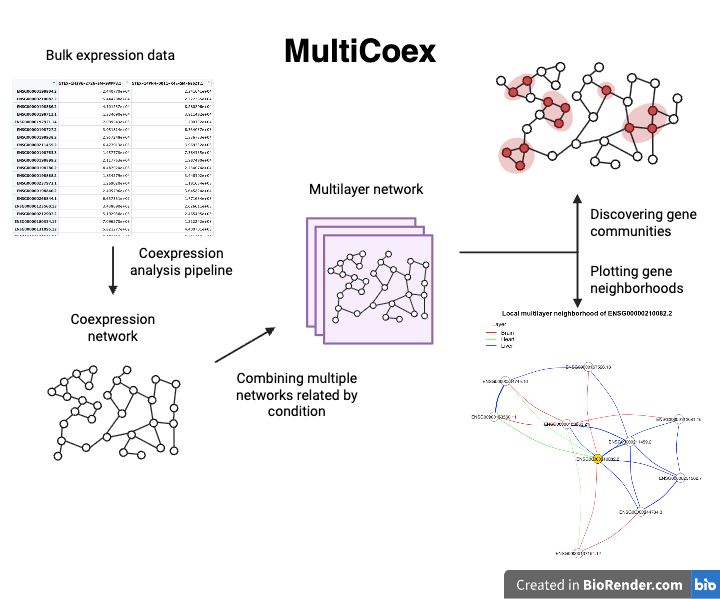

```{r, include = FALSE}
knitr::opts_chunk$set(
  collapse = TRUE,
  comment = "#>"
)
```

```{r setup}
library(MultiCoex)
```


## Introduction

`MultiCoex` is a package for differential coexpression analysis, using 
multilayered networks to find and analyze communities of genes. This could be 
useful for differential coexpression across tissues, developmental stages, or 
conditions.

To download `MultiCoex` do as follows:
``` r
require("devtools")
devtools::install_github("calebji123/MultiCoex", build_vignettes = TRUE)
library("MultiCoex")
```
To list all sample functions available in the package:
``` r
ls("package:MultiCoex")
```

To list all sample datasets available in the package:
``` r
data(package = "MultiCoex")
```

## General summary of the package

<div style="text-align:center">

<div style="text-align:left">

`MultiCoex` contains five major functions:


1. **developCoexpressionNetwork** for checking your data and concisely running the 
`BioNERO`pipeline to create a coexpression adjacency matrix.


2. **buildMultilayerNetwork** for building a multilayered network from multiple 
coexpression adjacency matrices to be used in subsequent steps, 
stored in a supra-adjacency matrix.


3. **detectMultilayerCommunities** for analyzing the multilayered network 
and using the Louvain algorithm to create communities throughout the network.


4. **plotCoexpressionNetwork** for plotting genes in a neighborhood around a 
seed gene in a multilayered graph, with colored edges representing layers.


5. **runMultiCoex** for creating the shiny interface, which is an interactive
web application that can upload data and interactively run the functions
provided in the `MultiCoex` package.


## Interative tutorial of the pipeline using GTEx example data

We will be using the three datasets provided in the package to demonstrate the
function's utility. You can read more about them:
``` r
?GTExBrainTrimmed
?GTExHeartTrimmed
?GTExLiverTrimmed
```

First, we calculate their coexpression through the first function 
`developCoexpressionNetwork` which uses BioNERO (internally uses WGCNA) to 
create the coexpression data. This will take a couple minutes. For more 
information about the `developCoexpressionNetwork` function, take a look at the help
documentation:
```r
?MultiCoex::developCoexpressionNetwork
```

``` r
library("SummarizedExperiment")
# Turn each of them into coexpression matricies
brainNet <- MultiCoex::developCoexpressionNetwork(
                          SummarizedExperiment::assay(GTExBrainTrimmed, "tpm"),
                          corMethod = "pearson")
heartNet <- MultiCoex::developCoexpressionNetwork(
                          SummarizedExperiment::assay(GTExHeartTrimmed, "tpm"),
                          corMethod = "pearson")
liverNet <- MultiCoex::developCoexpressionNetwork(
                          SummarizedExperiment::assay(GTExLiverTrimmed, "tpm"),
                          corMethod = "pearson")
```

Take a look at the returned data structure. There are many moving parts here,
but much of it is regular coexpression information returned from the `BioNERO`
pipeline, which we will not work with. The adjacency matrix is going to be the 
main focus of our analysis. 

```r
head(brainNet$adjacency_matrix)
dim(brainNet$adjacency_matrix) # 4754 x 4754
```

This is a square matrix of genes x genes. Each cell represents the degree of 
coexpression between those two genes. There are fewer than 5000 genes here 
because some genes are filtered out.


Then we layer the adjacency matrices into one object, which is the input
requirements for our next function.
``` r
layers <- list(Brain = brainNet$adjacency_matrix, 
               Heart = heartNet$adjacency_matrix, 
               Liver = liverNet$adjacency_matrix)
```

Since we trimmed these datasets, we will need to make sure that they all contain 
the same set of common genes, which we will define as the intersection of all 
their genes. 
``` r
commonGenes <- Reduce(intersect, list(
  rownames(brainNet$adjacency_matrix),
  rownames(heartNet$adjacency_matrix),
  rownames(liverNet$adjacency_matrix)
))
length(commonGenes) # 2279
```

The recommended omega (parameter which affects the level at which the layers are 
connected in the multilayer network) should be tuned based on the magnitude of 
the edge weights. Here, we recommend 500 times the median edge magnitude. 
You can play around with this parameter. Smaller numbers limit the effectiveness
of the multilayer network, whereas large numbers overpower interlayer 
connections.

``` r
ut <- function(M) M[upper.tri(M, diag = FALSE)]
typW <- median(unlist(lapply(layers, function(A) abs(ut(A))[abs(ut(A)) > 0])))
omega <- 500 * typW
```

We run `buildMultilayerNetwork` with these options. Threshold is at `0.05` to 
ensure that the coexpression network is not too busy and we filter out noise.
A threshold of `0.05` means that the top 5% of connections are retained in the 
network. For more information about the `buildMultilayerNetwork` function, take a look at 
the help documentation:
```r
?MultiCoex::buildMultilayerNetwork
```

``` r
multilayeredNetwork <- MultiCoex::buildMultilayerNetwork(layers, 
                                               genes = commonGenes,
                                               matchGenes = TRUE,
                                               omega = omega,
                                               threshold = 0.05)
attributes(multilayeredNetwork)
```

This outputted object has many attributes, but a lot are for reference. The main
attribute is `multilayeredNetwork$supra` which is a representation of the 
multilayered network in sparse format. 

``` r
head(multilayeredNetwork$supra)
```

As well, some important attributes to remember are `multilayeredNetwork$genes`
which shows a list of the genes used, as well as `multilayeredNetwork$layerNames`
which lists all the layer names.

``` r
head(multilayeredNetwork$genes)
multilayeredNetwork$layerNames
```

Then we discover gene communities in this multilayer network using the
`detectMultilayerCommunities` function. For more information about the 
`detectMultilayerCommunities` function, take a look at 
the help documentation:
```r
?MultiCoex::detectMultilayerCommunities
```

``` r
communities <- MultiCoex::detectMultilayerCommunities(multilayeredNetwork)
attributes(communities)
```

This function has a couple of key attributes. The simplest is `communities$Q`
which represents the modularity score, a numeric representation of how well a 
network is divided into modules.
``` r
communities$Q
```

The attribute `communities$stateMembership` shows the community membership of 
*every* node, and `communities$geneMembership` shows the community membership
of all the genes, which is determined through majority vote among layers.

```r
head(communities$stateMembership)
head(communities$geneMembership)
```


We can investigate the results deeper using the plot function. This requires a 
seed gene and builds a network around it. All the edges are shown from all layers
which allows for a deep analysis into what layers the
coexpression connections are happening on and how connections are changing 
between layers. Here we have an example seed gene `ENSG00000210082.2`, but
this choice holds little biological context. Feel free to try out other genes.

```r
MultiCoex::plotCoexpressionNetworks(multilayeredNetwork,
                                   seedGene = "ENSG00000210082.2",
                                   maxGenes = 10,
                                   k = 1,
                                   legendPosition = "topright")
```

For more information about the `plotCoexpressionNetworks` function, take a look at 
the help documentation:
```r
?MultiCoex::plotCoexpressionNetworks
```


## Package References
- Ji, C. (2025) MultiCoex: Multilayered approach to analyzing differential
  coexpression. Unpublished. URL https://github.com/calebji123/MultiCoex.

## Other References

- Langfelder, P., & Horvath, S. (2008). WGCNA: An R package for weighted correlation network analysis. BMC Bioinformatics, 9, 559. https://doi.org/10.1186/1471-2105-9-559
- Almeida-Silva, F., & Venancio, T. M. (2022). BioNERO: An all-in-one R/Bioconductor package for comprehensive and easy biological network reconstruction. Functional & Integrative Genomics, 22, 131–136. https://doi.org/10.1007/s10142-021-00821-9
- Russell, M., Aqil, A., Saitou, M., Gokcumen, O., Masuda, N. (2023). Gene communities in co-expression networks across different tissues. PLoS Comput Biol, 19(11). https://doi.org/10.1371/journal.pcbi.1011616
- The GTEx Consortium. (2020). The GTEx Consortium atlas of genetic regulatory effects across human tissues. Science, 369(6509), 1318–1330. https://doi.org/10.1126/science.aaz1776 
- Silva, A. (2022; revised 2025) TestingPackage: An Example R Package For BCB410H.
Unpublished. URL https://github.com/anjalisilva/TestingPackage.
- BioRender. (2020). Image created by Ji, C. Retrieved November 30, 2025, from https://app.biorender.com/
-	Chang, W., Cheng, J., Allaire, J. J., Sievert, C., Schloerke, B., Xie, Y., Allen, J., McPherson, J., Dipert, A., & Borges, B. (2024). Shiny: Web application framework for R (Version 1.8.0). https://shiny.rstudio.com/
- Csárdi, G., & Nepusz, T. (2006). The igraph software package for complex network research. InterJournal, Complex Systems, 1695. https://igraph.org
- Antonov, M., Csárdi, G., Horvát, S., Müller, K., Nepusz, T., Noom, D., Salmon, M., Traag, V., Welles, B. F., & Zanini, F. (2023). igraph enables fast and robust network analysis across programming languages. arXiv:2311.10260. https://doi.org/10.48550/arXiv.2311.10260
- Csárdi, G., Nepusz, T., Traag, V., Horvát, S., Zanini, F., Noom, D., Müller, K., Schoch, D., & Salmon, M. (2025). igraph: Network analysis and visualization in R (Version 2.2.1). https://doi.org/10.5281/zenodo.7682609
https://CRAN.R-project.org/package=igraph
- Bates, D., Maechler, M., & Jagan, M. (2025). Matrix: Sparse and dense matrix classes and methods (Version 1.7-4). https://doi.org/10.32614/CRAN.package.Matrix
https://CRAN.R-project.org/package=Matrix
- Morgan, M., Obenchain, V., Hester, J., & Pagès, H. (2025). SummarizedExperiment: A container for matrix-like assays (Version 1.38.1). https://doi.org/10.18129/B9.bioc.SummarizedExperiment
https://bioconductor.org/packages/SummarizedExperiment
- R Core Team (2025). R: A Language and Environment for Statistical Computing. R Foundation for Statistical Computing, Vienna, Austria. https://www.R-project.org/


----

```{r}
sessionInfo()
```


